# Design & Architecture — Open Source Screenwriting Application

**Project:** Developing Open Source Screenwriting Software  
**Author:** Oliver Myers | COM629  
**Stack:** C++, Qt 6, Qt XML, CMake  
**Pattern:** MVVM (Model–View–ViewModel)

---

## 1. Overview

The application follows the **MVVM** pattern, separating the Qt UI layer from the
business logic and data models. A central `ScriptManager` owns the document model
and is responsible for all OSF XML serialisation. A `ScriptViewModel` mediates
every interaction between the view widgets and the model, preventing any direct
coupling between the two.

---

## 2. Architecture Layers

| Layer | Classes | Responsibility |
|---|---|---|
| **View** | `MainWindow`, `ScriptEditor`, `SceneNavigator` | Qt widgets, user input, display |
| **ViewModel** | `ScriptViewModel` | Formatting rules, element cycling, autocomplete, file I/O delegation |
| **Model** | `Script`, `Scene`, `ScriptElement` | Pure data, no Qt dependencies |
| **Services** | `ScriptManager`, `OsfSerializer`, `PdfExporter`, `CharacterRegister` | Persistence, export, auxiliary logic |

---

## 3. Class Diagram

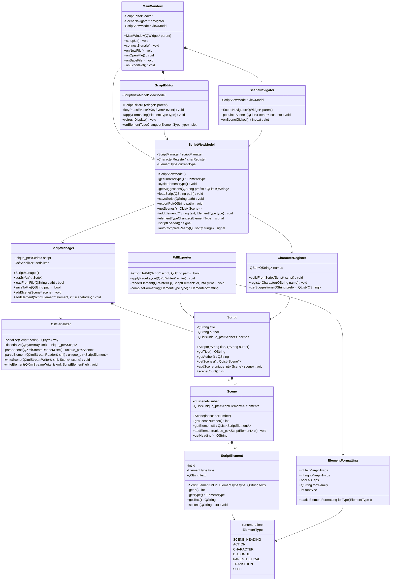

---

## 4. Element Formatting Reference

These values are derived from industry standard (Trottier, 2014) and encoded
as constants returned by `ElementFormatting::forType()`.

| Element Type | Left Margin | Right Margin | Capitalization | Notes |
|---|---|---|---|---|
| `SCENE_HEADING` | 1.5 in | 1.0 in | ALL CAPS | e.g. `INT. OFFICE - DAY` |
| `ACTION` | 1.5 in | 1.0 in | Normal | Block description |
| `CHARACTER` | 3.7 in | 1.0 in | ALL CAPS | Centred above dialogue |
| `DIALOGUE` | 2.5 in | 2.5 in | Normal | Under character name |
| `PARENTHETICAL` | 3.1 in | 2.5 in | Normal | `(beat)` style |
| `TRANSITION` | 4.0 in | 1.0 in | ALL CAPS | e.g. `CUT TO:` |
| `SHOT` | 1.5 in | 1.0 in | ALL CAPS | Sub-heading |

---

## 5. Tab Key Element Cycling — State Diagram

Pressing **Tab** cycles the current element type following the industry-standard
screenplay flow. Pressing **Enter** on specific elements triggers a pre-defined
next element (e.g. Enter after a Character name jumps to Dialogue).

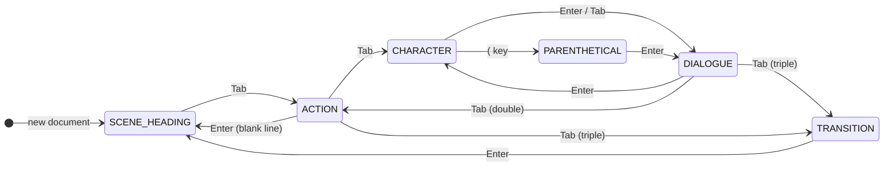

### Key Press Decision Logic

```mermaid
flowchart TD
    A([Key Pressed]) --> B{Which key?}
    B -->|Tab| C{Current Element}
    B -->|Enter| D{Current Element}
    B -->|Open paren '('| E{Current Element is CHARACTER?}

    C -->|SCENE_HEADING| F[→ ACTION]
    C -->|ACTION| G[→ CHARACTER]
    C -->|CHARACTER| H[→ DIALOGUE]
    C -->|DIALOGUE| I[→ CHARACTER]
    C -->|PARENTHETICAL| J[→ DIALOGUE]
    C -->|TRANSITION| K[→ SCENE_HEADING]

    D -->|CHARACTER| L[→ DIALOGUE]
    D -->|DIALOGUE| M[→ CHARACTER]
    D -->|TRANSITION| N[→ SCENE_HEADING]
    D -->|blank ACTION| O[→ SCENE_HEADING]
    D -->|other| P[New line, same type]

    E -->|Yes| Q[→ PARENTHETICAL]
    E -->|No| R[Insert literal '(']
```

---

## 6. Sequence Diagrams

### 6.1 Application Startup

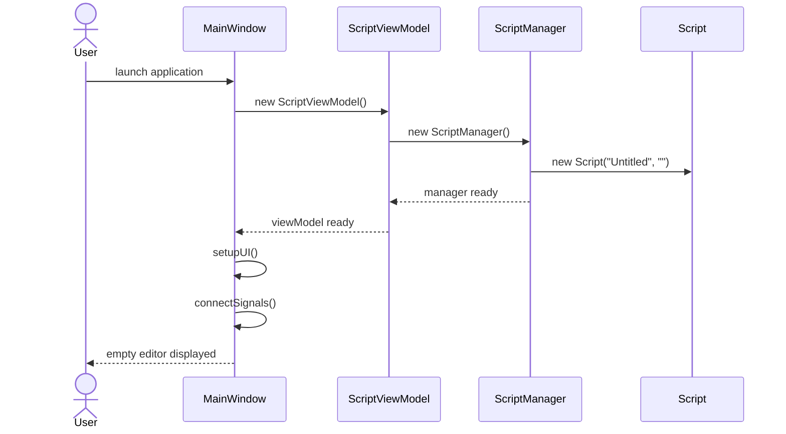

---

### 6.2 Save Script to OSF XML

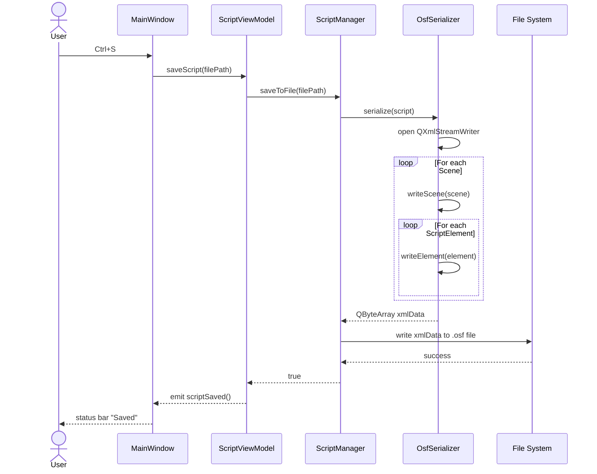

---

### 6.3 Load Script from OSF XML

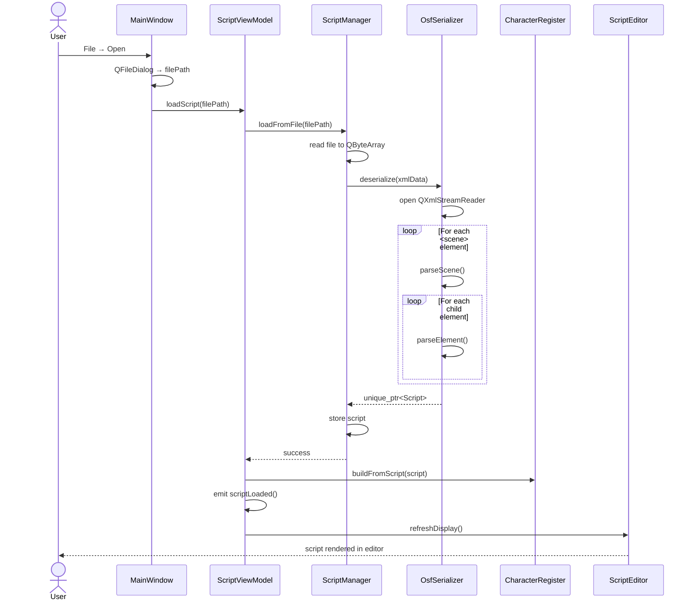

---

### 6.4 Tab Key Press — Element Cycling

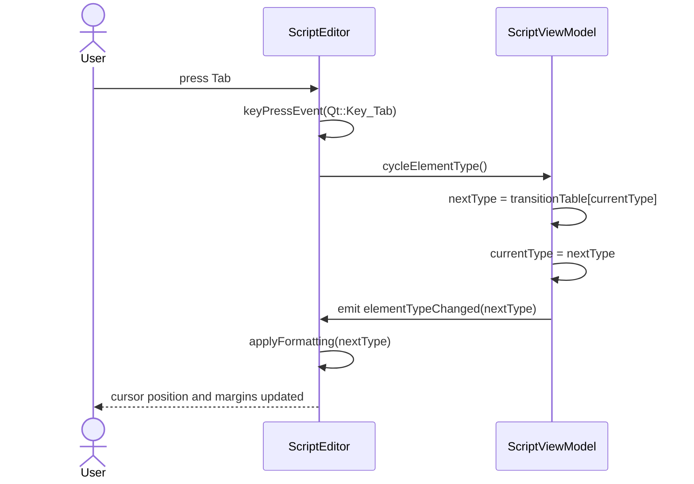

---

### 6.5 Character Autocomplete (SmartType)

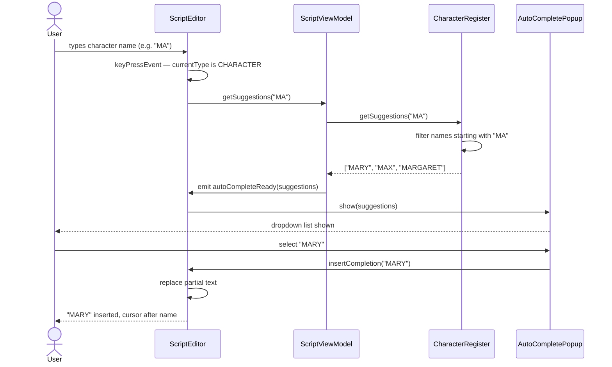

---

### 6.6 Export to PDF

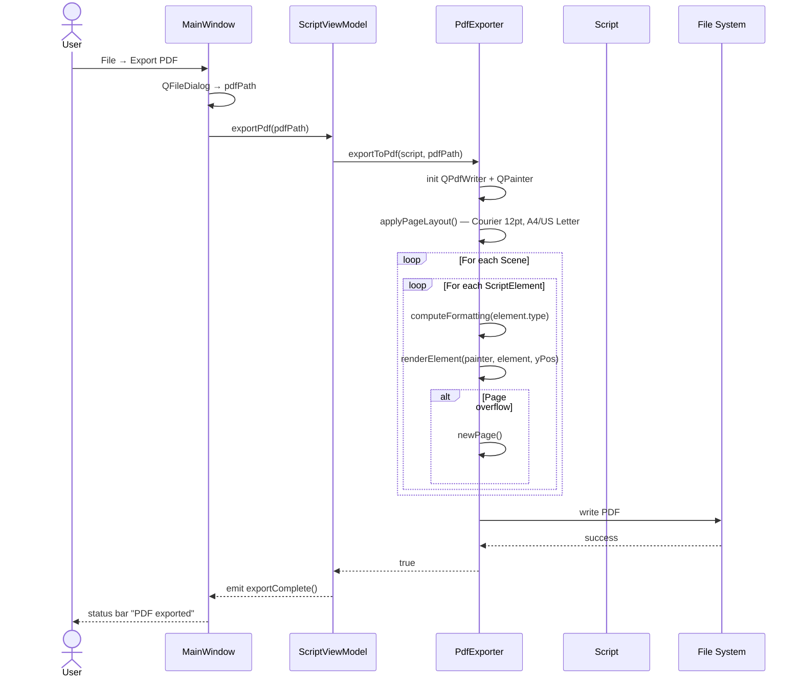

---

### 6.7 Navigate to Scene

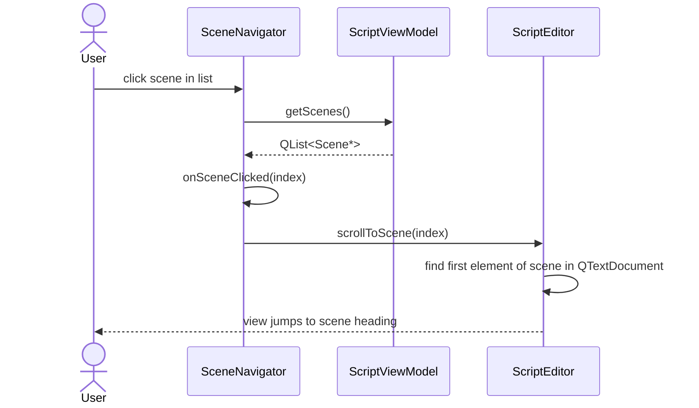

---

## 7. Data Flow Diagram — Script Lifecycle

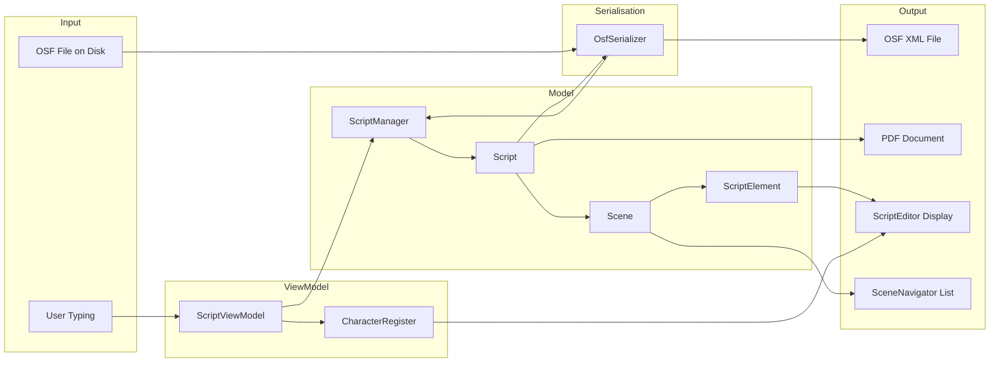

---

## 8. OSF XML Schema Overview

The application reads and writes the Open Screenplay Format (v4) XML structure.
The key mapping between the OSF XML elements and the application's model is:

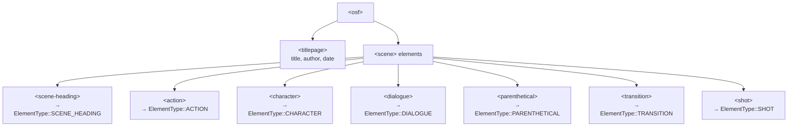

---

## 9. Sprint Plan Mapping to Architecture

| Sprint | Feature | Classes Involved |
|---|---|---|
| **Sprint 1** — Core Engine | Element typing, Tab cycling, formatting | `ScriptEditor`, `ScriptViewModel`, `ScriptElement`, `ElementFormatting` |
| **Sprint 2** — Navigation | Scene navigator panel | `SceneNavigator`, `ScriptViewModel`, `Scene` |
| **Sprint 3** — Serialisation | Open/Save OSF, PDF export | `ScriptManager`, `OsfSerializer`, `PdfExporter` |
| **Sprint 4** — Polish | Autocomplete, accessibility | `CharacterRegister`, WCAG compliance in `ScriptEditor` |

---

## 10. Technology Stack Summary

| Component | Technology | Rationale |
|---|---|---|
| Language | C++ 17 | Performance, memory control |
| Memory management | `std::unique_ptr`, `std::shared_ptr` | Safe ownership without GC overhead |
| UI Framework | Qt 6 Widgets | Cross-platform, low latency rendering |
| Text Engine | `QTextEdit` / `QTextDocument` | Handles long documents with custom formatting |
| XML I/O | `QXmlStreamReader` / `QXmlStreamWriter` | SAX-style, efficient for large OSF files |
| PDF Export | `QPdfWriter` + `QPainter` | Native Qt, no external dependency |
| Signals/Slots | Qt meta-object system | Decouples ViewModel from View |
| Build system | CMake | Cross-platform, Qt recommended |
| Diagrams | Mermaid.js | Version-controllable UML |
| Wireframes | Figma | WCAG 2.1 validation |

---

## 11. Design Patterns Applied

| Pattern | Where Used | Purpose |
|---|---|---|
| **MVVM** | Entire architecture | Decouple UI from business logic |
| **Strategy** | `ElementFormatting::forType()` | Swap formatting rules per element type |
| **Observer** (Qt Signals/Slots) | `ScriptViewModel` → View | Loose coupling between ViewModel and widgets |
| **Factory** (implicit) | `OsfSerializer::parseElement()` | Create correct `ScriptElement` subtype from XML tag |
| **Flyweight** | `ElementFormatting` | Share immutable formatting objects across elements |

---

*Diagrams rendered with [Mermaid.js](https://mermaid.js.org). All UML follows the project OSF v4 spec and Qt 6 architecture conventions.*
