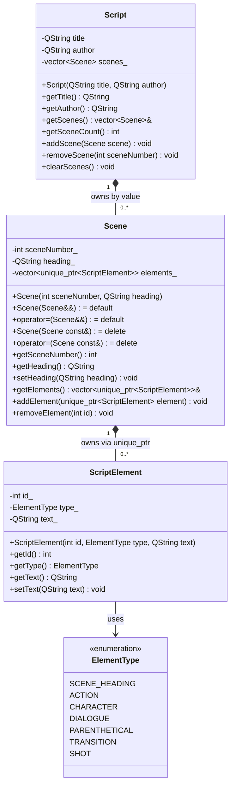

# Model Layer Class Diagram

```mermaid
classDiagram
    direction TB

    class Script {
        -QString title
        -QString author
        -vector~Scene~ scenes_
        +Script(QString title, QString author)
        +getTitle() QString
        +getAuthor() QString
        +getScenes() vector~Scene~&
        +getSceneCount() int
        +addScene(Scene scene) void
        +removeScene(int sceneNumber) void
        +clearScenes() void
    }

    class Scene {
        -int sceneNumber_
        -QString heading_
        -vector~unique_ptr~ScriptElement~~ elements_
        +Scene(int sceneNumber, QString heading)
        +Scene(Scene&&) = default
        +operator=(Scene&&) = default
        +Scene(Scene const&) = delete
        +operator=(Scene const&) = delete
        +getSceneNumber() int
        +getHeading() QString
        +setHeading(QString heading) void
        +getElements() vector~unique_ptr~ScriptElement~~&
        +addElement(unique_ptr~ScriptElement~ element) void
        +removeElement(int id) void
    }

    class ScriptElement {
        -int id_
        -ElementType type_
        -QString text_
        +ScriptElement(int id, ElementType type, QString text)
        +getId() int
        +getType() ElementType
        +getText() QString
        +setText(QString text) void
    }

    class ElementType {
        <<enumeration>>
        SCENE_HEADING
        ACTION
        CHARACTER
        DIALOGUE
        PARENTHETICAL
        TRANSITION
        SHOT
    }

    Script "1" *-- "0..*" Scene : owns by value
    Scene "1" *-- "0..*" ScriptElement : owns via unique_ptr
    ScriptElement --> ElementType : uses
```