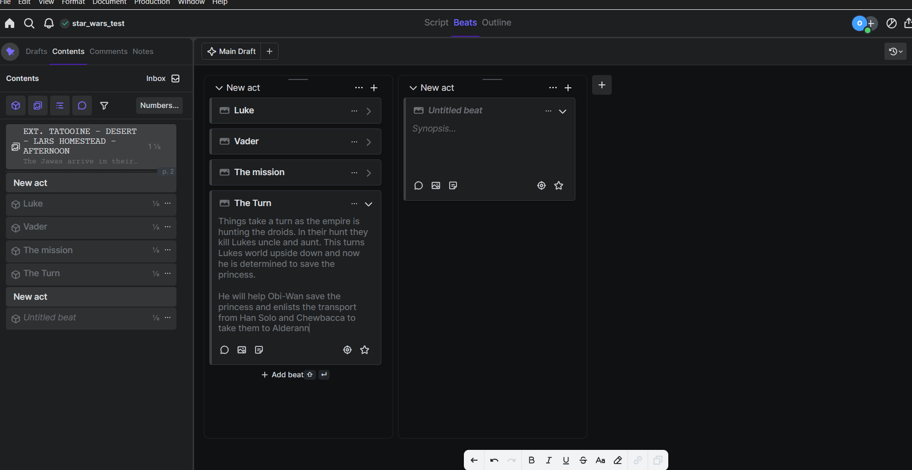
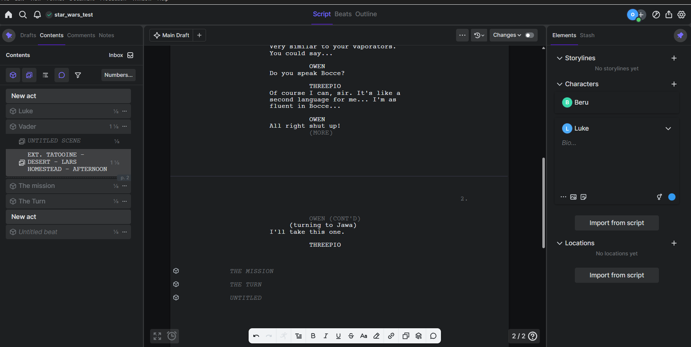
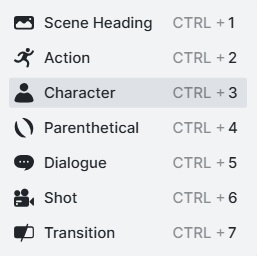
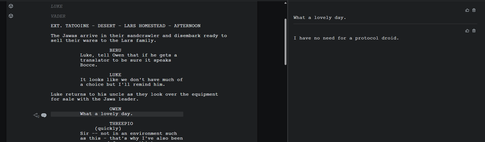
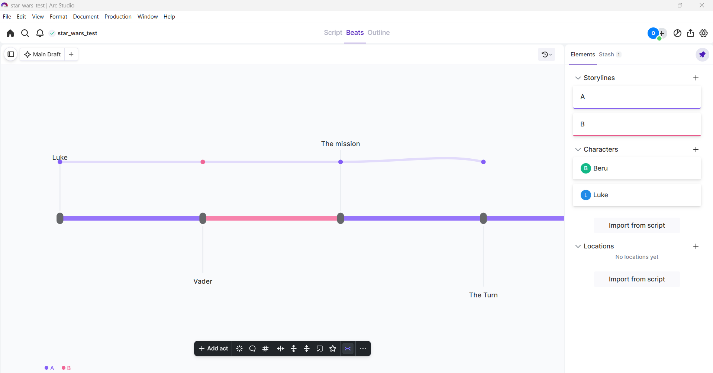

# Arc Studio

This document outlines the research done on the Arc Studio software.

**PRICE: USD$69 per year subscription**

## Contents
- [Arc Studio](#arc-studio)
  - [Contents](#contents)
  - [Installation](#installation)
  - [Test Project](#test-project)
  - [List of Features](#list-of-features)
  - [External References](#external-references)
  - [Conclusions](#conclusions)

## Installation
Before installation it should be noted that there is a free version of this software however it is
severely limited to two scripts at one time, watermarking for pdf export and missing lots of
features that can be found in the *Essentials* plan and the *Pro* plan. For this testing the free
trial which is the Pro plan is being used.

The windows version of this software was used. Arc studio also make a Mac version of this software, 
an iOS version, as well as having a web application that can be run from the browser.

The application was downloaded from the Arc Studio website in the form on an executable and run to
install.

It should be noted that you must have an Arc Studio account to use any of their services.

Detailed guides for all their features were found at [Arc Studio Help Center](https://help.arcstudiopro.com/)

## Test Project
There is an **import** feature for importing a script(`.fdx`, `.fountian`, `.pdf`, word)

An empty project was created and the first thing done was creating beats using the beats feature.
This is called the **Plot Board** in Arc Studio:

These then show up in the editor when writing the script. This feature allows for planning and
clarity when the writing process begins.

Also note that the following elements are available to use in the script:

The rest of the script was written and the sidebar on the left was explored which has **Drafts**, 
**Contents**, **Comments**, and **Notes**.

The drafts feature shows drafts of the script with available **snapshots** and **history**. The
**Contents** menu outlines Acts, Beats and Scenes in chronological order. The **Comments** menu
allows creation of comments with the ability for collaborative discussion and a **resolve** feature
that gets rid of the comment. **Notes** function as extra files for planning and taking notes. These
are text files with the feature of exporting into a beat and templating.

The **Outline** feature displays all the beats in chronological order and gives an idea of the
progression of the story.

There is a statistical **Reports** feature that gives **Scene Reports**, **Location Reports**, and
**Cast Reports**. This gives valuable information that also leans towards features for production.

The biggest feature done right by Arc Studio is their **collaboration** features. It works very
similarly to a google document in the seemless collaboration. This works as the script being edited
is stored on cloud servers.

Arc Studio also has a **Stash** Feature where lines can be cut from the script and put in the stash
where they can later be recovered and put back into the script if need be. This *safe* place for
ideas to be placed reduces the need of lots of notes and enables the user to consider lots of
creative options before commiting to their final draft.

The **Alternates** Feature provides having differing dialogue lines that can be toggled. This
provides more flexibility for writers.

**Arc View** provides visualisation of the storylines behind the script. The lines linking the
specific plot can be moved up or down to refelct on the movements of the story.

This screenshot also demonstrates the lightmode of the application.

It should be noted that Arc Studio is cloud first but **caches** the script locally and can 
therefore be edited offline.

## List of Features
**Writing Engine**
- Contextual Auto-Complete: *suggests locations already found in script*
- Stash Feature
- Tabbing Logic: Including icon in left margin to display the element.
- Alternate Dialogue
**Story Architecture & Planning**
- Plot Board
- Story Arcs
- Non Printable Beats: There for writing assistance and ignored when exported.
**Production & Workflow**
- Scene Numbering
- Revision Management
- Automated Reports
- Color coded Revisions
**Collaboration & Data Management**
- Realtime Multi User Editing
- Automatic Snapshots
- Branch Copies
- Local Backup Directory
**Accessibility & Value**
- Price: USD$69 per year
- Multiplatform & Web based
## External References

[Industrial Scripts](https://industrialscripts.com/best-script-writing-programs/#h-arc-studio-cloud-based-screenwriting-software-for-screenwriters)
lists Arc Studio as one of *Final Draft's* bigges competitors and list key features that 
screenwriters would like: **Real-Time Collaboration**, **Beat Board** (*Plot Board*),
**Cloud Based**, **Offline Mode**.

[Film Maker Tools](https://www.filmmaker.tools/arc-studio-pro)
- "The user interface is clean and easy to navigate, making it easy for writers to focus on their 
  craft." This was something that I agree with, it is modernized in comparison to many competitors
  in the same market.
- "The first baseline test of any screenwriting software is to determine if it can produce a 
  properly formatted script. Without this simple functionality, all of the other features are 
  rendered useless." This highlights the main functinality that is expected from screenwriting
  software: **Formatting**
- This article also praises these features:
  - **Import/Export** to `.pdf`, `.fountain`, and final draft formats.
  - **Cross Platform Compatability**
  - **Digital Whiteboard**
- What Arc Studio does right: "What sets Arc Studio Pro apart is its real-time collaboration 
  capabilities, digital whiteboard story planning, writing schedule and reminders, notifications, 
  and security options."

[NoFilmSchool](https://nofilmschool.com/writers-are-choosing-arc-studio) notes the features that
users appreciate:
- **Real Time Collaboration**
- **Version Control**
- **Automatic Formatting**
- **In app feedback**: Notes and comments all in one place.

[Miracalize](https://miracalize.com/arc-studio-review/)
- **Collaboration Feature** "This feature is the selling point of Arc Studio software."

[The Writer Coach](https://www.thewritercoach.com/blog/2025/4/7/arc-studio-pro-professional-scriptwriting-in-the-cloud)
provides some downsides to Arc Studio:
- **Final Polish** is an afterthought. "you'll wind up exporting your work to another program, 
  Final Draft or the like"
- **Bugs** are a problem which can lead to loss of data.

## Conclusions
The **modern UI** is a selling point that Arc Studio has over competitors such as *Final Draft*.

The **Collaboration** feature is its biggest selling point but relies on cloud servers and so is
potentially out of the scope of my project along with having a web application.

The **Price** is a expensive yearly subscription which turns away hobbyists and beginners.

Features such as **Story Arcs** and **Alternate Dialogue** enhance the experience as it eliminates
the need for lots of notes and file managmement.

As Arc Studio is primarily Cloud Based it is not possible to reverse engineer files although they
can be exported into `.fdx`, `.fountain` and `.pdf`. Arc Studio have stated that they use
PostgreSQL databases.

