# Celtx

**PRICE: £9.37 per month**

## Contents
- [Celtx](#celtx)
  - [Contents](#contents)
  - [Installation of Software](#installation-of-software)
  - [Test Project](#test-project)
    - [Script Editor](#script-editor)
    - [Beat Sheet](#beat-sheet)
    - [Collaboration](#collaboration)
    - [Catalog](#catalog)
  - [List of Features](#list-of-features)
  - [External References](#external-references)
  - [Conclusions](#conclusions)

## Installation of Software
Celtx software runs in the browser meaning there is no downloadable software for this product.

## Test Project
The goal of this test project is to recreate a few of the scenes from the first Star Wars
screenplay: **Star Wars: A New Hope**. In doing this features will be discovered and researched.

### Script Editor

The first screen a new user would see when using Celtx is the following:

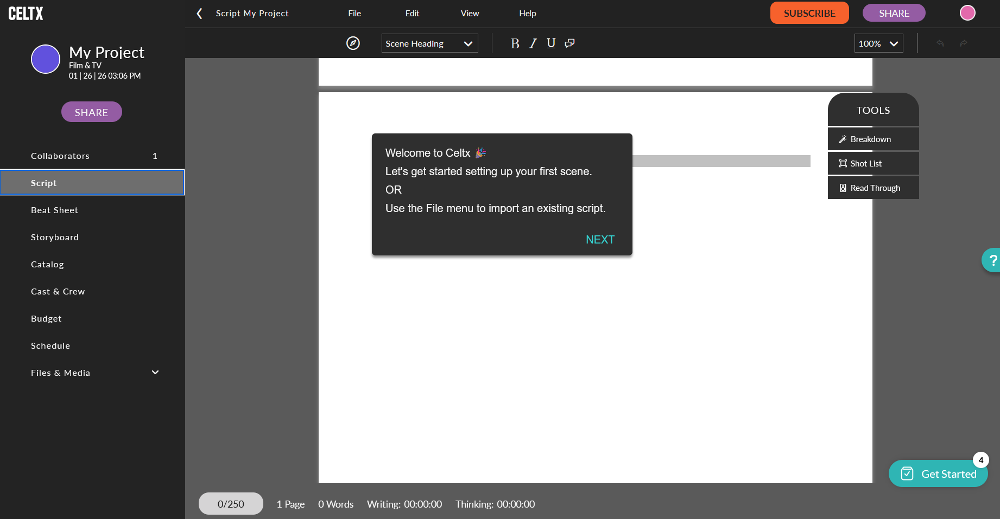

It is aparent that Celtx provides features that cater to the writer for writing the script as well
as for other members of a production team such as creating tags for props, visual effects and
costumes. 

In recreating the script for Star Wars it was noted that Celtx provides a **Goals** feature that is
used to encourage users to write a certain number of words per day. This feature also provides a
deadline for users as seen below:

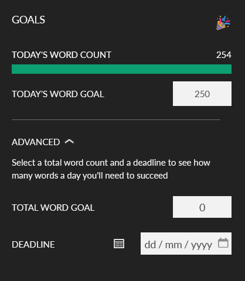

This feature is expanded along the bottom of the window when writing. The goal set by the user is
displayed along with information about the script such as the **pages**, **word count**, **writing
time**, **thinking time** and the last time the project was **saved**:

The test project script was written as seen below:

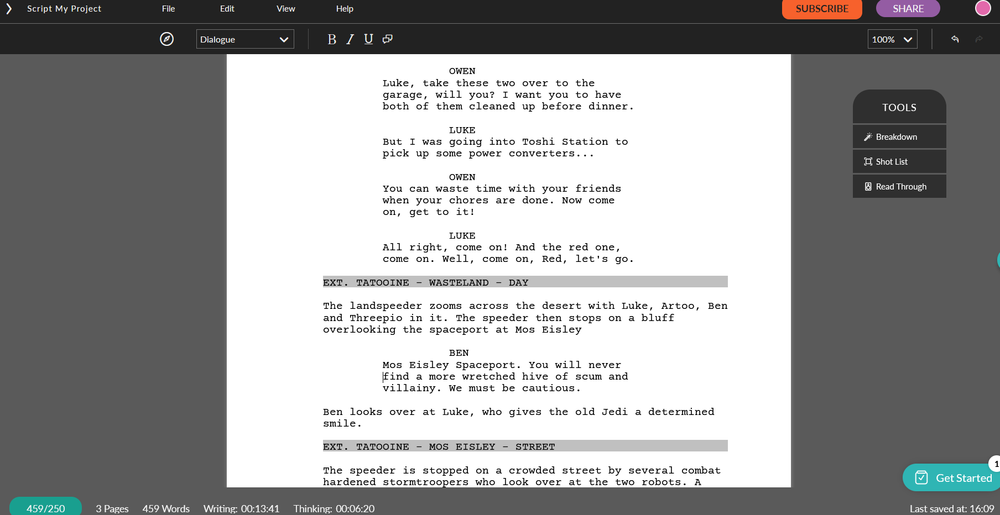

Notably, Celtx uses the **tab key** to cycle through the **elements** of a script (dialogue, action,
etc.) When this is done, Celtx provides a suggestion to the writer so that the writer knows what
element they are writing:

The element being written can also be selected from the **minimal toolbar** above:

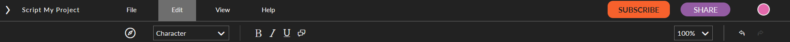

There are also hotkeys designated to each element the user can select:

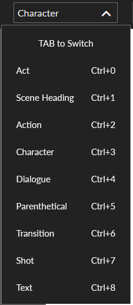

### Beat Sheet

Celtx provides the functionality of a beat sheet seen below:

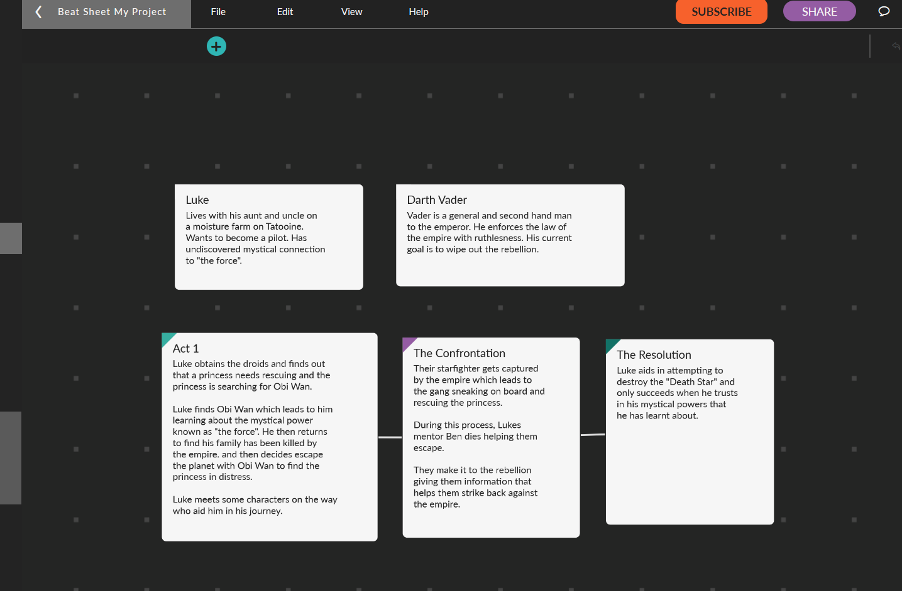

Functionality is provided to link beats together and colour code them for organisation. **Comments**
can also be left on the beat sheet as seen below. These are useful for collaboration and 

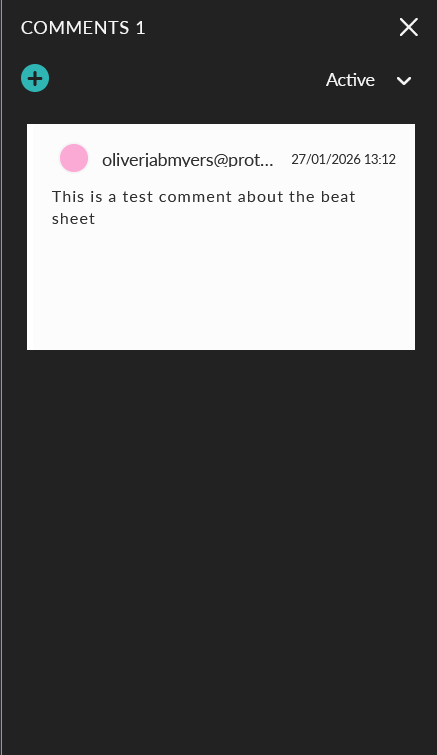

### Collaboration
Throughout the process of screenwriting, collaborators can edit and leave comments, collaborators
can be seen through the collaboration screen:

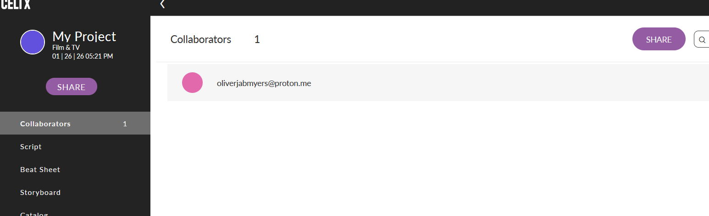

The storyboard is a feature that will be used collaboratively with the cinematographer of the
project and provides a way of outlining shots for the scenes:

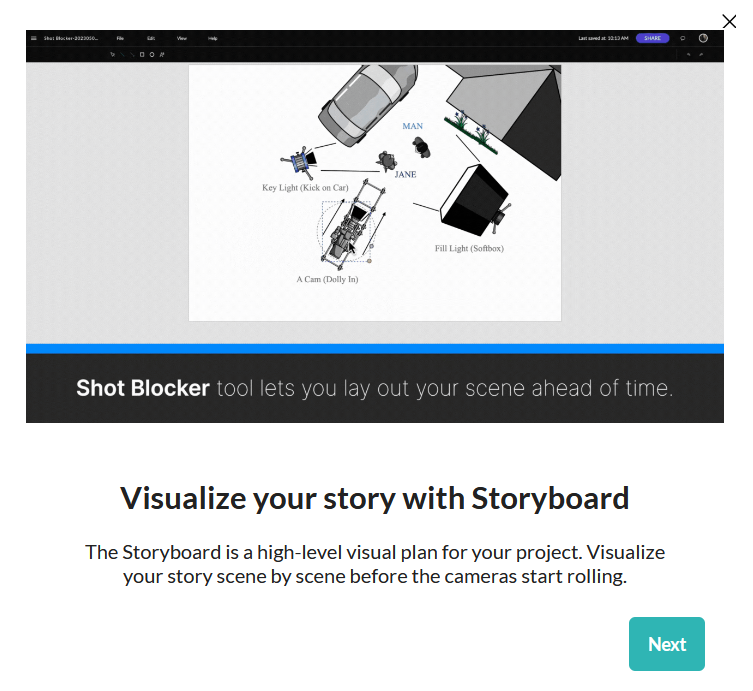

### Catalog
This feature shown below enables the team to catalog all the assets of the project. This involves
budgeting and estimating finances and logistics for the filming of a screenplay. The images below
show the dashboard and options for adding information to a character asset.

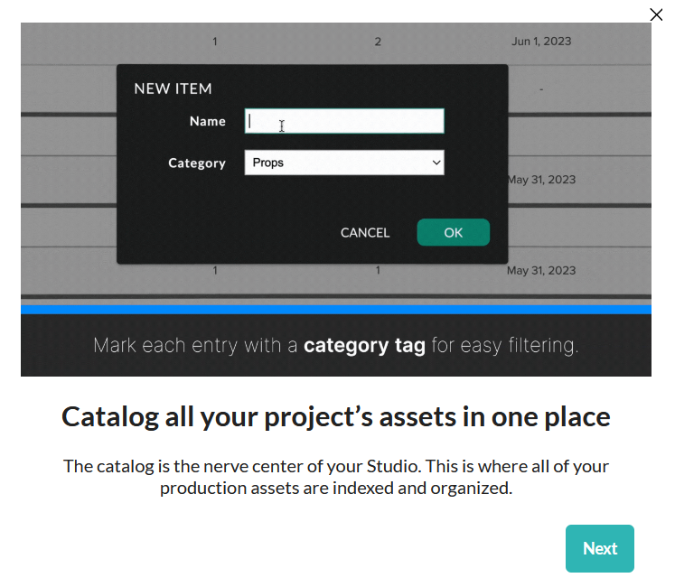
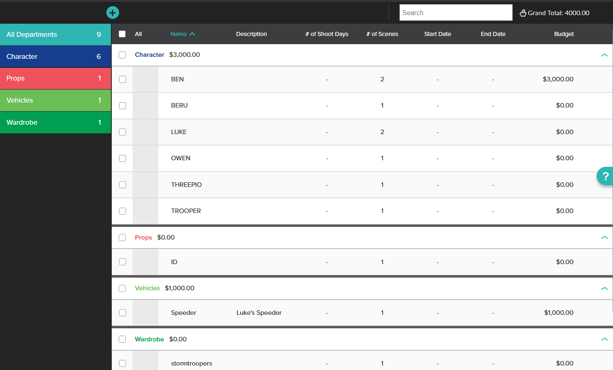
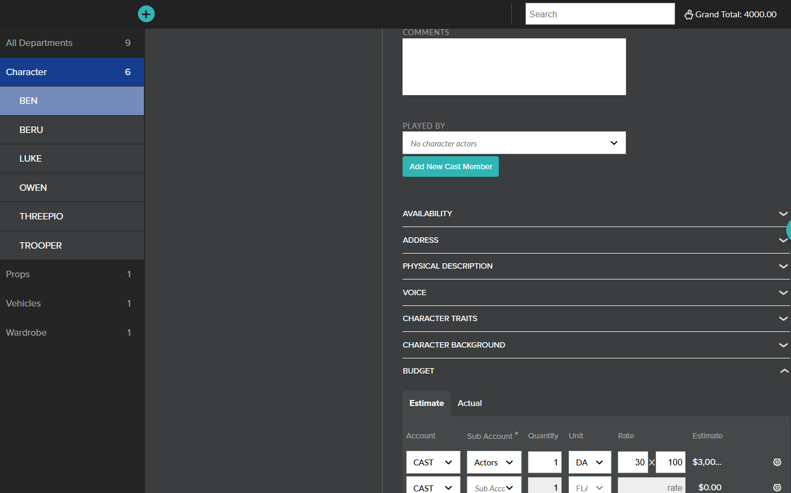

## List of Features
**Writing Engine**
- Smart Formatting (Tab + Enter logic)
- Element Assist: Contextual suggestions for character names etc.
- Custom themes

**Story Architecture & Planning**
- Visual Beat Sheet
- Storyboard module
- Script Insights
- Index Cards

**Production & Workflow**
- Script Breakdown: Manual and automatic tagging of assets
- Production Catalog
- Schedule
- Budgeting
- Call Sheets & Slides

**Collaboration & Data Management**
- Collaboration
  - Presense Awareness
  - Comments
  - Version History & Drafts
  - Shareable Links

**Accessibility & Value**
- Browser Based
- Price: £9.37 per month

## External References

[Brad Brookes](https://www.freelancevideocollective.com/reviews/celtx/) in his review mentions:
"However, more experienced writers who are focused purely on writing may find some of the extra 
**production tools unnecessary**." And also: "Lastly, because Celtx is **cloud-based**, larger or
more complex projects can sometimes feel a bit slower, particularly when loading or switching 
between tools."

[Josh Fechter](https://www.squibler.io/learn/software/celtx-review/)"For a solo writer just wanting 
to work on their scripts, however, it can be a little overwhelming. They won’t need the 
collaboration capabilities and they won’t use many of the features."

[Film Lifestyle](https://filmlifestyle.com/celtx-review/) notes that "One of Celtx’s strengths lies 
in its affordability." This is true as a monthly subscription but it is still a *paid* software.
This article also notes the following features as what makes Celtx stand out:
- **Intuitive Script Editor**
- Real time **Collaboration**
- Extensive Cataloging
- **Script Insights**: statistical analysis of the script.

## Conclusions
Celtx provides lots of features for the pre production and production process that are very good
but maybe out of the scope of a pure screenwriting application. With that being said, features like
**Tagging** for assets can be very useful. Celtx stores their data on cloud servers which introduces
security risks.

Celtx can export into `.fountain`, `.pdf`, and `.txt` but notably does not export into the `.fdx`
format which is industry standard. 

My impression of the UI is that it it minimal and modern but lacks the polish of some other
competitors in the market such as *Fade In* and *Arc Studio*. While the editor and formatting work,
these features feel clunky and unfinished.

Finally it should be noted that this is a subscription service and not free which detracts from
the value.

