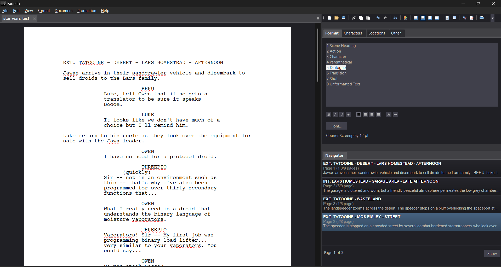
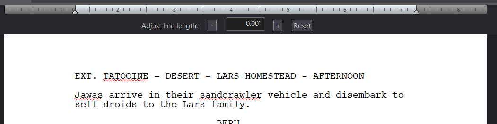
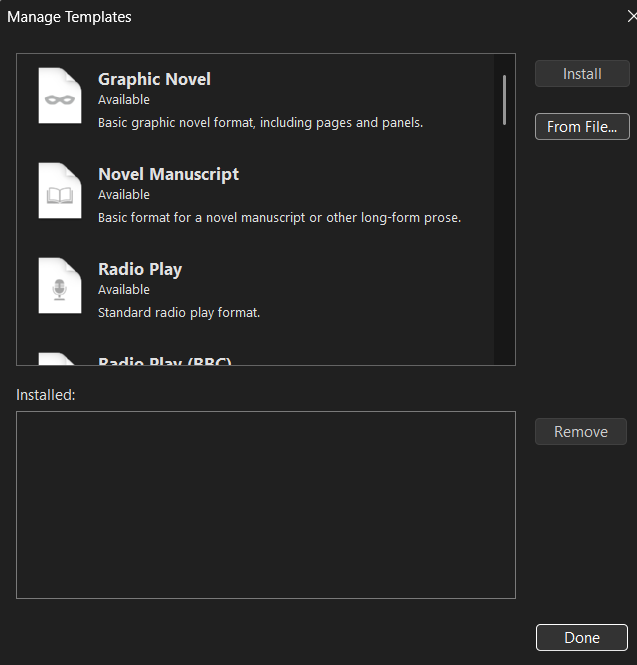
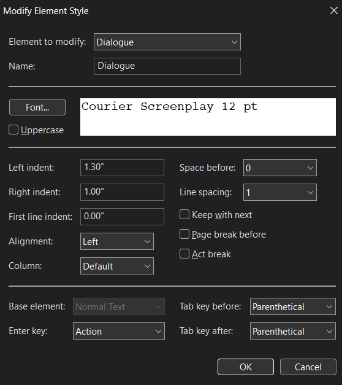
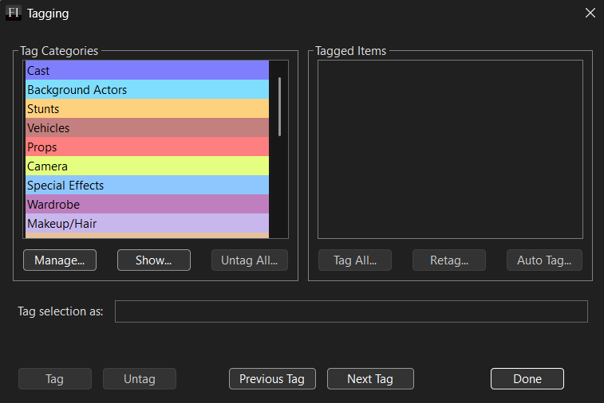

# Fade In

The following document outlines the market research done on the Fade In software product. The
desktop sofware for windows was used for this. The fade in software is also available on Mac and
Linux. Fade In also offers a cloud storage service for saving files.

**PRICE: USD$79.95**

## Contents
- [Fade In](#fade-in)
  - [Contents](#contents)
  - [Installation](#installation)
  - [Test Project](#test-project)
  - [List of Features](#list-of-features)
  - [External References](#external-references)
  - [Conclusions](#conclusions)

## Installation
The demo software was downloaded from the official Fade In website in the form of an executable
installer. This was run and Fade In was installed.

## Test Project
The test project is writing a few scenes from Star Wars IV: A New Hope. 

Fade In prompted a project creation from the start and this can be saved locally or on Fade In
cloud storage. As can be seen below the scenes were created using the editor. The editor uses
tabbing to switch between certain script elements.
- After a character text, tabbing switches the elements from dialogue to parenthetical.
- Tabbing also autocompletes character names in the character text.
This can also be changed in the **format menu** on the right side.This menu also manages characters, 
locations, Scene Intros, Scene Times, Character Extensions, Transitions; along with general text
formatting and adjusting the line length:

Below that is the **navigator** that can jump throughout the script and is able to toggle 
information such as:
- Scene Content
- Synopsis Content
- Notes
- Bookmarks
- Page Count

Above the format menu there are tools that are important, they are:
- New Document
- Open Document
- Save
- Cut, Copy, Paste
- Undo, Redo
- Find
- Custom View Controls (Darkmode/Lightmode)
- Views
  - Normal
  - Continuous
  - Page
  - Side by Side
- Show Title Page
- Index Cards
- Revisions/Revision Mode
- Print

Revision mode colors pages that have been altered as well as the text that has been altered. These
revisions can then be committed by highlighting revisions (or everything) and going to the
production menu where actions can be completed.

Fade In offers templates for starting a project as seen here:

In regards to importing and exporting both can be done for these file formats:
|Import|Export|
|------|------|
|`.astx`|`.txt`Formatted and Unformatted|
|`.cetlx` or `.cxscript`|`.epub`|
|`.fdx` or `.fdr`|`.fdx`|
|`.txt`Formatted and Unformatted|`.fountain`|
|`.fountain`|`.html`|
|`.highland`|`.xml` Open Scheduling Format|
|`.html`|`.rtf`Scrivener Import and Split|
|`.rtf`|`.xml`Open Screenplay Format|
|`.pdf`||
|`.scriv`||
|`.xml`Open Screenplay Format||

Other features include recovering a backup, passwording the file. Session Statistics including
goals, sprint timer, time spent (session), total words typed (session), total words and total pages.

There is a preferences, as well as a fullscreen option and fullscreen minimal for focus. Further
element configuration can be seen below:

There is also a note feature, notes can be inserted inline with the script.

A production feature is tagging which can be seen below and allows the writer/producer to go through
the script and tag things like Props, Cast Members, Locations etc.

## List of Features
**Writing Engine**
- Predictive SmartType
- Contexual Tabbing
- Multi-Language/Unicode Support

**Story Architecture & Planning**
- Navigator
- Index Cards
- Synopsis & Notes
- Bookmarks & Links

**Production & Workflow**
- Industry Standard Revision Mode
- Page & Scene Locking
- Script Breakdown & Tagging
- Watermarking
- Templates

**Collaboration & Data Management**
- Open Screenplay Format `.fadein`: very interoperable
- Optional Cloud Service
- Session based collaboration
- Document Compare

**Accessibility & Value**
- Works identically on Windows, Mac and Linux
- Free Updates once bought
- Session Statistics

**Script Editor**
- Script Elements
  - Scene Heading
  - Action
  - Character
  - Parenthetical
  - Dialogue
  - Transition
  - Shot
  - Unformatted Text
- Format Menu
- Character List
- Location List
- Navigator
- Change Character Name
**Utility**
- Export
- Import
- New Document, Open Document, Save Document
- Views (Normal, Continuous, Page, Side by Side)
- Show Title Page
- Index Cards
- Revisions/Revision Mode
- Print
- Synopsis
- Bookmarks
- Image insert
- Quick Reformat
- Window Resize
- Show Invisibles
- Focus Current Text
- Extensions
- Password
- Watermark
- Recover Backup
- Cloud Storage
- Collaboration
**Customisability**
- Page Layout
  - Page size
  - Margins
  - Line Handling
  - Element Spacing
- Header & Footer
- Templates
**Production**
- Page Numbering
- Scene Numbering
- Element Numbering
- Element Numbering
- Numbering Locking
- Tagging
- Omit Scene
**Other**
- Statistics
  - Session Statistics
  - Session Target
  - Sprint Timer
  - Document Statistics

## External References

[Jill Duffy](https://www.pcmag.com/reviews/fade-in?test_uuid=04IpBmWGZleS0I0J3epvMrC&test_variant=A)
lists some pros:
- Rich with features
- Competetively Priced
- Supports Industry Standard Formatting
as well as some cons:
- PDF import tool could use improvement
- Autosaves every two minutes

[Justin Morrow](https://nofilmschool.com/2013/06/fade-in-screenwriting-software-review) notes that
"Fade In doesn't have the numerous pre-production elements native to applications like Final Draft 
and Celtx".

## Conclusions

This market research led to the finding of [Open Screenplay Format](https://github.com/OpenScreenplayFormat/osf-sdk)
which is going to be highly considered for the project.

Positives
- Uses `.fadein` format based on Open Screenplay Format 
- Store files locally
- UI Design
- Lots of useful features

Negatives
- Price (USD$79.95)
- No beat board