# Final Draft

The following document outlines the market research done on Final Draft and their screenwriting
product. The Windows version of their product was used for this.

**PRICE: USD$249.99**

## Contents
- [Final Draft](#final-draft)
  - [Contents](#contents)
  - [Installation](#installation)
  - [Test Project](#test-project)
    - [Beginning and Plan for the Project](#beginning-and-plan-for-the-project)
    - [Writing using the Editor](#writing-using-the-editor)
  - [List of features](#list-of-features)
  - [External References](#external-references)
  - [Conclusions](#conclusions)

## Installation
The installation process for final draft was very simple involving downloading a zipped folder and
running the installer present inside.

## Test Project
The test project is a reconstruction of the first Star Wars screenplay using the final draft
software. Final Draft provides an onboarding experience for new screenwriters that was explored for
this test project.

### Beginning and Plan for the Project

Upon starting the software, new software features were displayed:

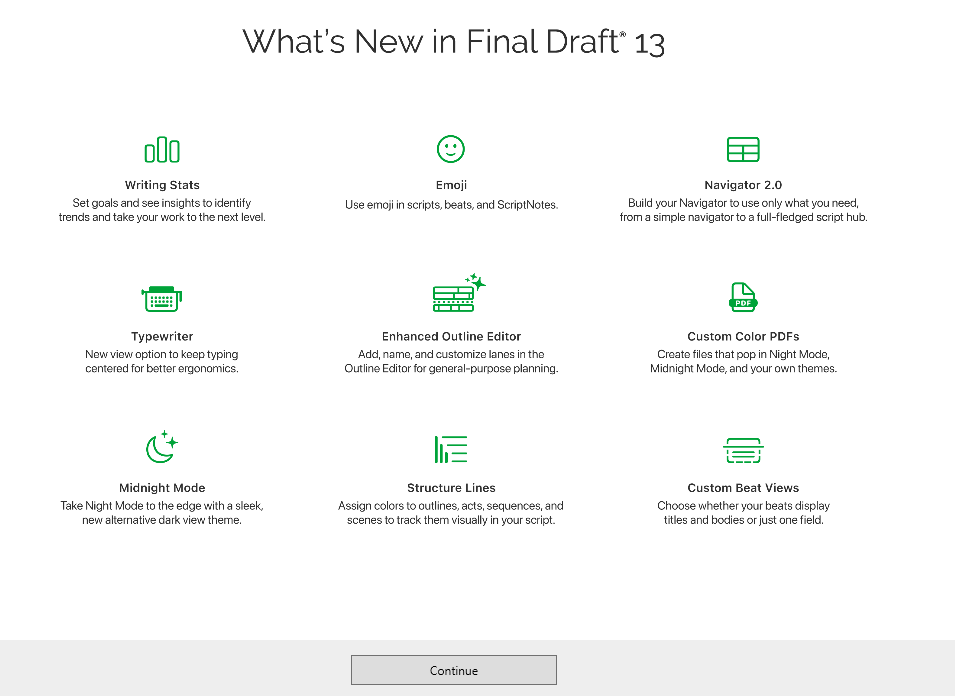

Then the following form had to be filled out to gauge the user experience before suggesting where
the user should start:

After filling out these forms, final draft prompts the user to complete the idea to draft tutorial.
This was followed to understand the software. A project was then created with a tutorial popup to
follow along with:

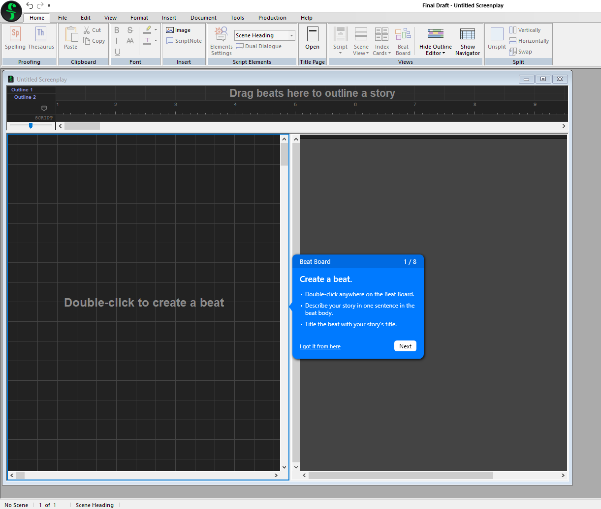

While following through with this tutorial information was given on the basic structure of
screenplays such as acts and the structure:

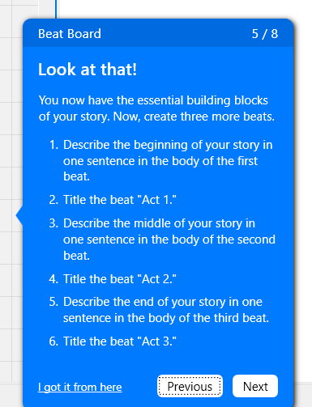
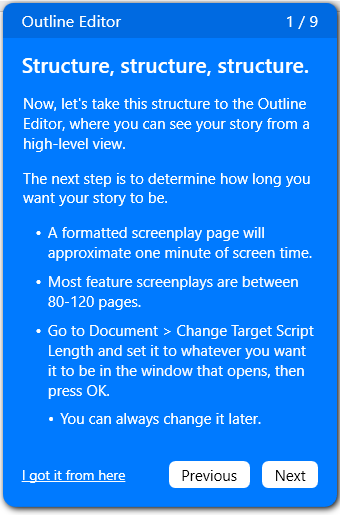

Following on from the tutorial we arrive at a stage of the project where we have the following:

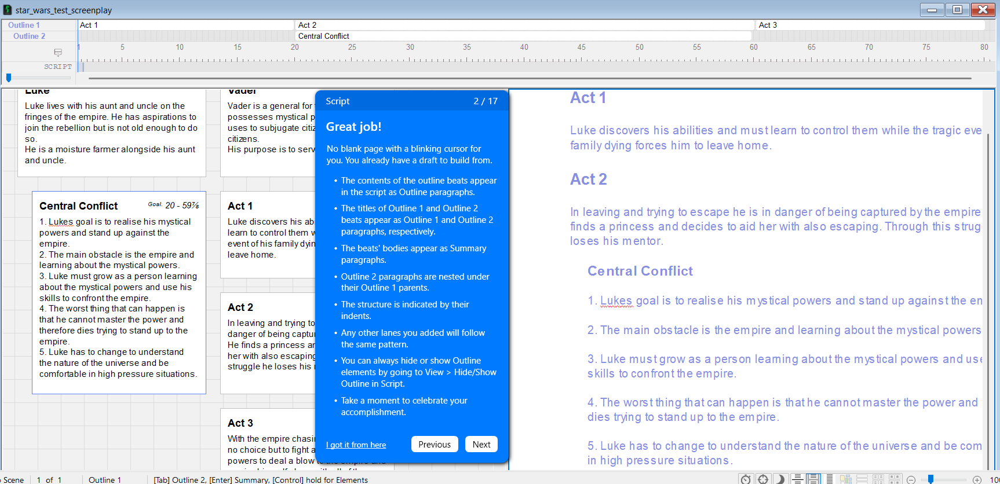

On the left hand side there is a window for all the beats of the screenplay. Along the top there is
the general structure of the project that is measured in pages and which you can place the beats of
the screenplay along. Once this is done with varying levels of complexity, you can generate the
draft framework for the screenplay in the right window. 

This means that through planning of the screenplay through beats, there is a draft script for the
project. This helps users start writing and as Final Draft tells you: "No blank page with a 
blinking cursor for you. You already have a draft to build from".

Final Draft Also has a **Navigator** which is when a window pops up showing the script while
abstracting detail. This can be clicked on to move throughout the script.

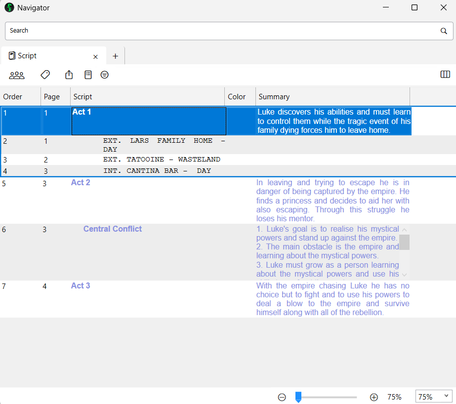

Final Draft Provides Element Configuration, Smart Types and Macros that can all be edited in their
relavent settings as seen below.

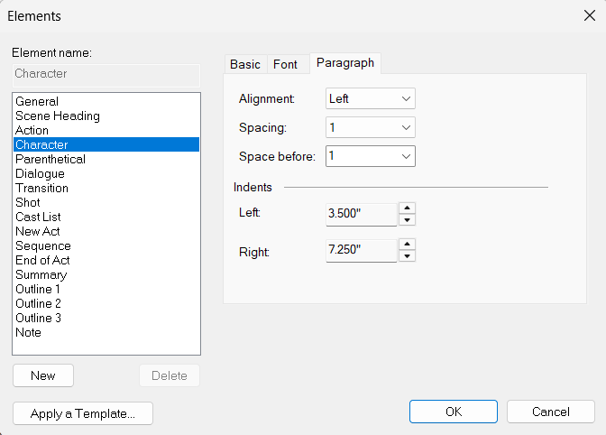
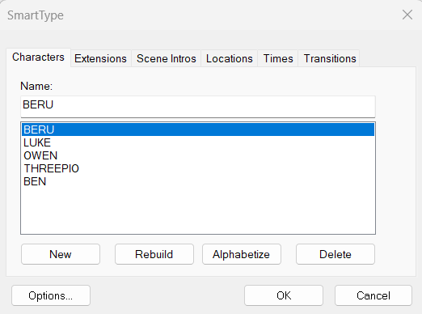
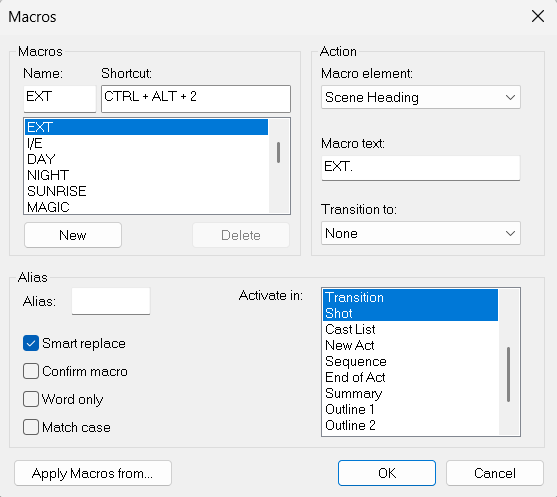

### Writing using the Editor

Unlike editing a word document or text file the `.fdx` format has elements which follow one after
another. That means that there is no hard return or paragraph break. These elements are formatted on
the page to appear as the industry standard as seen here:

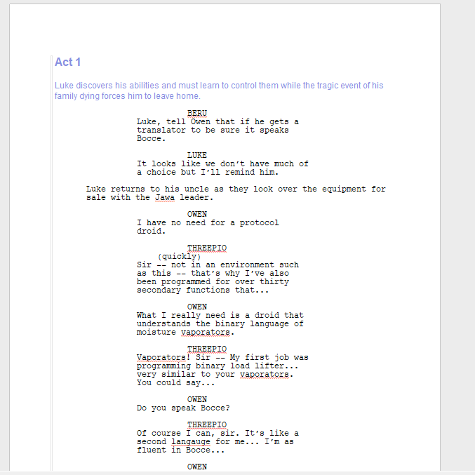

After doing this and writing a few lines of dialogue the tutorial comes to a close.

Through opening the `.fdx` file in a text editor we can see what it looks like and understand how it
works behind the scenes:

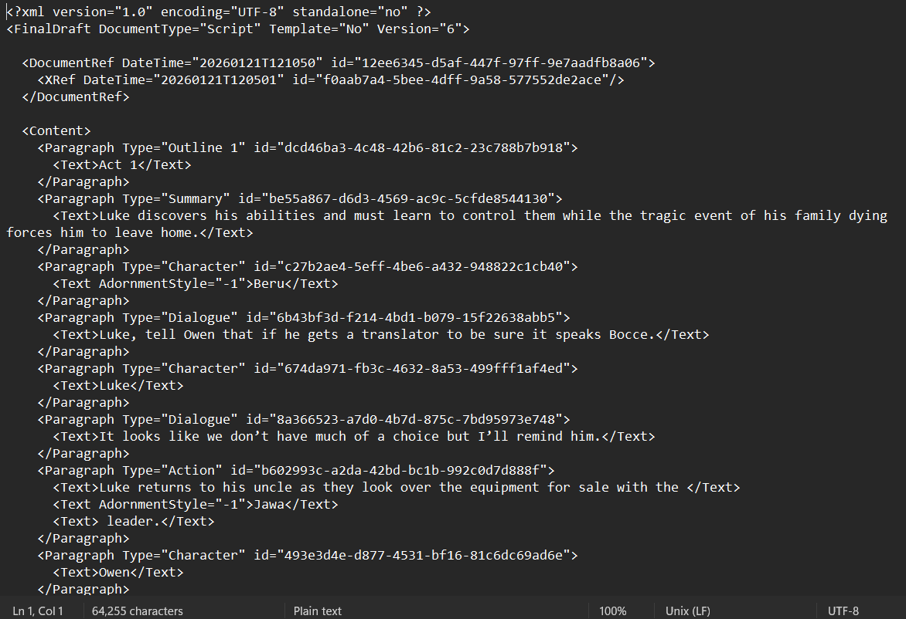

It should be noted that the **revisions** feature means that when the script is locked, adding a
line on page 10 makes page 10A and keeps all subsequent pages in their positions.

Another huge feature is that it integrates with Movie Magic Scheduling (MM Scheduling). This is the
industry standard software for production features. It takes `.fdx` files.

## List of features
**Writing Engine**
- Smart Type (Tab + Entering)
- Window Management
- Structure Lines
**Story Architecture & Planning**
- Beat Board
- Outline Editor
- Index Cards
- Bookmarks & Notes
**Production & Workflow**
- Scene Numbering & Locking
- Revisions
- Snapshots
- Statistics
- Reports & Goals
**Collaboration & Data Management**
- Import/Export
- Collaboration: Hosted on your device
**Accessibility & Value**
- WGA (Writers Guide Assosiation) Integration

## External References
[Industrial Scripts](https://industrialscripts.com/best-script-writing-programs/#h-final-draft-the-industry-standard-for-professional-screenwriters)
notes features from final draft:
- **Script Formatting**
- **Revision Tracking**
- **Collaboration Tools**
- **Customizable Templates**
They also note [here](https://industrialscripts.com/final-draft/#h-to-final-draft-or-not) that final
draft is the industry standard "but to the newer writer the price tag can be a turn-off."

[Jill Duffy](https://www.pcmag.com/reviews/final-draft?test_uuid=04IpBmWGZleS0I0J3epvMrC&test_variant=A)
provides an overview of pros which are:
- Well tailored for screenwriters
- Good **Collaboration** features
- Offers industry standard **templates**
and some cons which are:
- Autosave is once every three minutes
- **Expensive**

## Conclusions
Final Draft is the Industry standard for a reason. It provides a feature rich experience all while
developing the `.fdx` format. It can have a hard learning curve for all the features but this is
easier than a non screenwriting specific application.

The **price** turns away some hobbyists and newcomers but they do offer a trial period.

Final Draft does not use cloud servers for storing projects meaning all files are **stored locally** 
on your device. This is considered a weakness in a market with software such as Arc Studio.

Final Draft is used because a Line producer would need an `.fdx` file of the script. This is the
**industry standard**.

Integrating `.fdx` formats into my project is high complexity, complext production features do not
have to be part of the minimal viable product.

