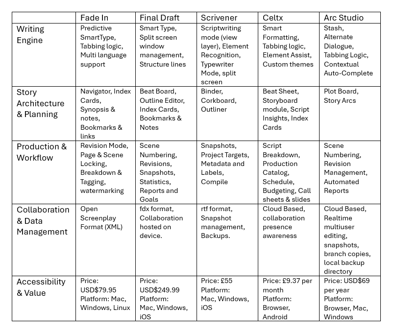

# Market Research

The goals of the market research for each product are as follows:
- List of all the features provided
- List of positive and negative elements of the product.
- Document recreating the **Star Wars: A New Hope** first scene and overview.

The script for **Star Wars: A New Hope** was obtained from [Script Slug](https://www.scriptslug.com/script/star-wars-episode-iv-a-new-hope-1977)

From this information, a survey will be conducted and a list of features produced with varying
priority. This information informs the project plan and management of the next actions.

## Features

It was decided that the features wil be broken down into the following Categories
- Writing Engine
- Story Planning & Architecture
- Production & Workflow
- Collaboration & Data Management
- Accessibility & Value

The features are compared in the table below:

