# Scrivener

This document outlines the research done on the Scrivener screenwriting software.

**PRICE: £55**

## Contents
- [Scrivener](#scrivener)
  - [Contents](#contents)
  - [Installation](#installation)
  - [Test Project](#test-project)
    - [Tutorial](#tutorial)
    - [Star Wars Project](#star-wars-project)
  - [List of Features](#list-of-features)
  - [External References](#external-references)
  - [Conclusions](#conclusions)

## Installation
For this test project the free trial was used. An executable file was downloaded and run with
installation being easy and seemless.

## Test Project

### Tutorial
When first running Scrivener, an interactive tutorial was recommended and followed.
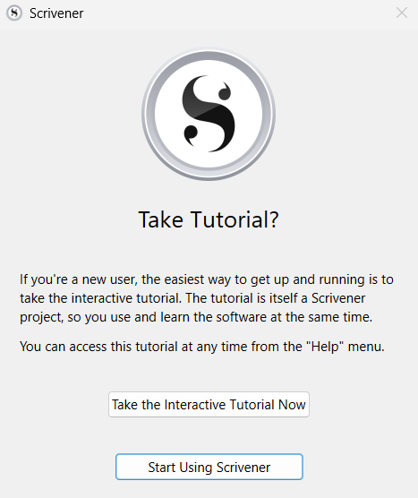

The following is the first view of the Scrivener software.
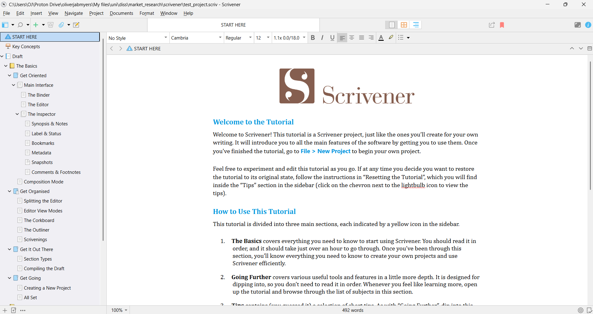

Scrivener's tutorial is an interactive walkthrough for all the features present in the application.
It outlines the **Binder** which is the file explorer on the left. The **Editor** which is the main
window. Along with the **Inspector** that gives information relating to the doucment shown in the
editor (notes, bookmarks, metadata, snapshots, comments & footnotes).

Above the editor there is a format bar that has common formatting features. The format menu at the
top also features a **screenwriting** mode and a **revision** feature containing five colors for
revisions.

The **header view** is below the format bar and allows the user to split the editor into two
sections. It also provides a feature of navigating to the previous file that was open. You can also 
drag a file from the binder into the header bar to load it.

The **footer bar** shows information such as word count and zoom percentage. It also provides a
**target** feature for the number of words in the document. When viewing a `pdf`, you can navigate
through pages using the footer.

The **synopsis** of the file is a virtual index card in which you can type the synopsis of the
document. A core idea of scrivener is that every section of a project is assosiated with a synopsis.
This can be viewed in the inspector or among other synopses in the **corkboard** or **outliner**.
The **notes** section is where you can make notes on documents that you do not want in the text.

You can also asign **labels** and **status** to a document which are arbitrary tags. These tags can
be setup in the **Project settings**. Status is intended to be used like *to do* and *finished*.
Labels have colours assosiated with it whereas status does not. These can also be assigned through a
right click on files in the binder.

**Bookmarks** allow the user to store references to other documents in the project. These can be
other documents, files or URLs. There are specific document bookmarks as well as project bookmarks
that can be found in the toolbar.

There is general **metadata** in the metadata tab in the inspector. The `include in compile` option
determines whether the document should be in the final manuscript when compiled. `Section Type` is
used to determine how to format the current document in the final manuscript. **Custom Metadata**
allows for checkboxes, pop-up menus, dates and text fields that keeps track of information that
cannot be kept anywhere else. Custom Metadata can be setup from the project settings. **Keywords**
are for themes referenced or topics discusses and make searching for documents easier. These can be
dragged onto documents in the binder.

**Snapshots** is a feature that keeps older versions of the document around for reference. Snapshots
can be taken from the *documents* menu and can be viewed in the inspector. Clicking on a snapshot
will show it in the snapshot viewer and there is a compare feature and a rollback feature. Rolling
back will prompt the user to take a snapshot before rolling back. The documents that have snapshots
have a different icon in the binder.

**Comments** and **Footnotes** can be added and viewed in the *Comments & Footnotes* section of the
inspector.

**Composition Mode** is a sort of focus mode for writing documents. This can be customised in the
appearance tab in the options. You can also add an image to be the background of composition mode.
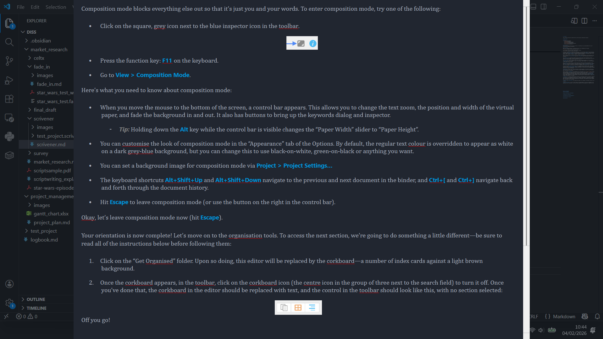

There are four **View Modes** in Scrivener. They are:
- **Single Document Mode**: Shows the content of the current document that also works for viewing
  images, and `pdf`s.
- **Corkboard Mode**: The editor shows the *subdocuments* of the current document as index cards.
- **Outliner Mode**: This shows the subdocument of the current documents presented in rows with
  various information.
- **Scrivenings Mode**: This is a combined text mode and allows for editing of multiple text
  documents as though they were a single document. This is available when a folder is selected (this
  could also be any folder or document containing subdocuments), or when multiple documents are
  selected in the binder. When selecting one of these the single document mode button changes to the
  scrivenings mode.

The screenshots below show the **Corkboard Mode** and the **Outliner Mode**:
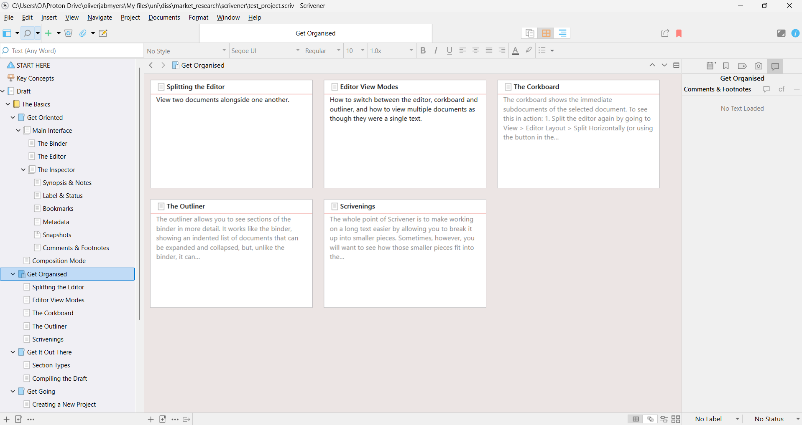
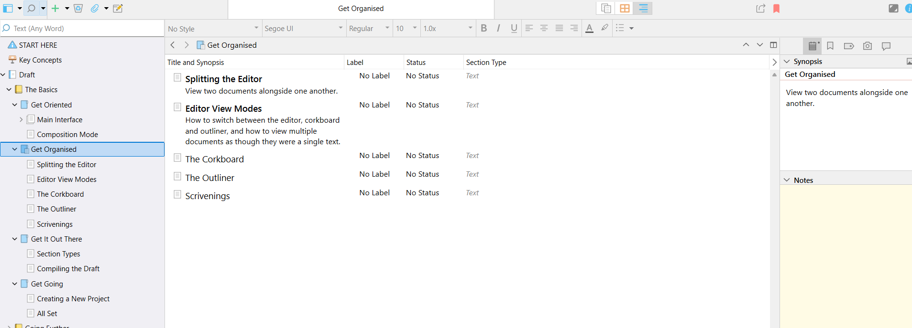

Options for the **Corkboard** and **Outliner** can be found in the footer bar when they are open and
in the view menu.

**Section Types** are used to tell scrivener what each document is. For example you could have a
"Title Page", "Introduction", "Chapter" and "Scene". Under the *metadata* tab in the inspector there
is an option for section type. The section type can be manually set or set to "Structure-Based".
The project settings can be setup in a way that automatically picks a section type based on its
indentation in the project files. If a project is created using the *templates* feature then this
will be configurated accordingly. 

The **Compile** feature is one of the core features of scrivener and enables multiple documents to
be compiled and outputed as one in a format of the users choice. The compile screen can be seen
below:
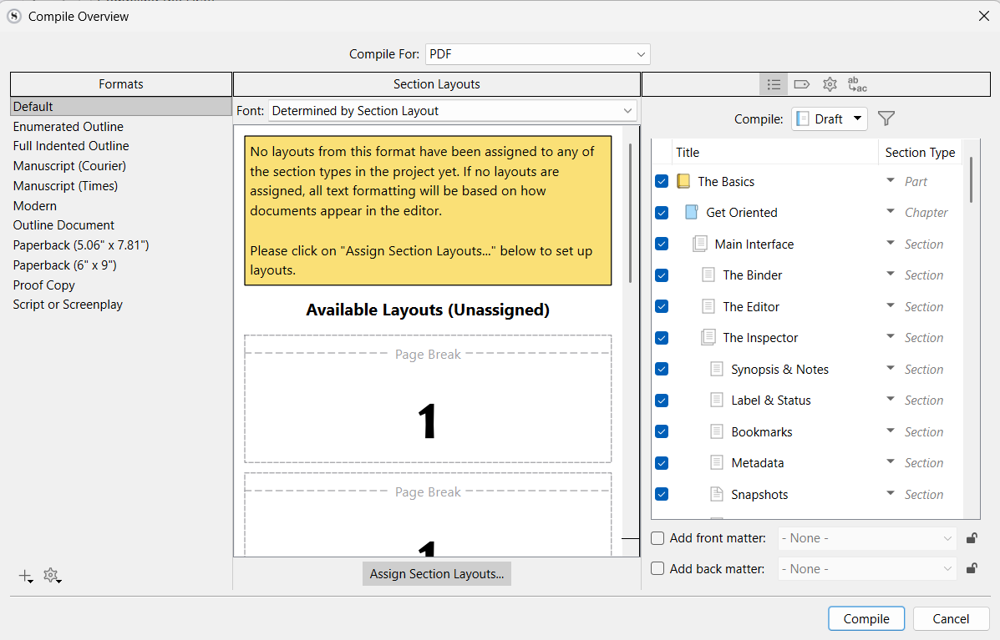

The compile feature also has formatting for different purposes. In this way you can write in
whatever font and format you want and then change the format in the compile settings.
**Each compile format consists of a number of "section layouts"**. You can set a section layout to
each section format that tells scrivener how to format. This can be done from compile in the
compile settings. You can create your own compile formats from here as well as duplicate and change
existing ones.

**Backups** are done everytime a project is closed and up to 5 are stored at one time. These are
stored locally and functionality can be altered from the options menu. There is also an option for
manual backup and backing up to a specific location.

Scrivener uses `.scrv` projects and a `.scrvx` file to open the project.

### Star Wars Project
To make the Star Wars test project, the screenplay template was used as seen below along with the
template file structure:
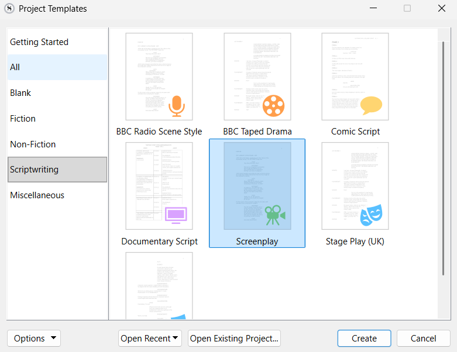
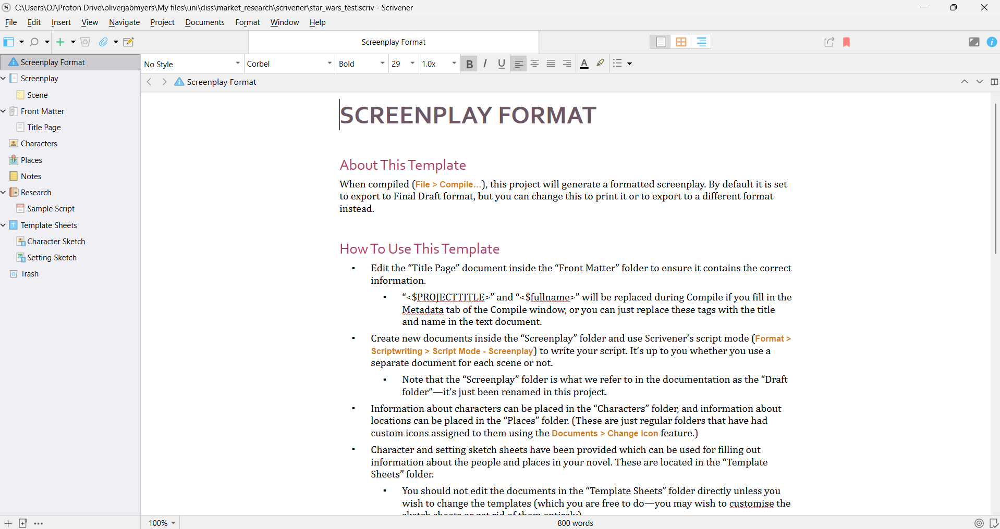

As seen in the screenshot below, three scenes were copied out from the Star Wars IV A New Hope
script and put into the documents *scene*, *scene 2* and *scene 3*. 
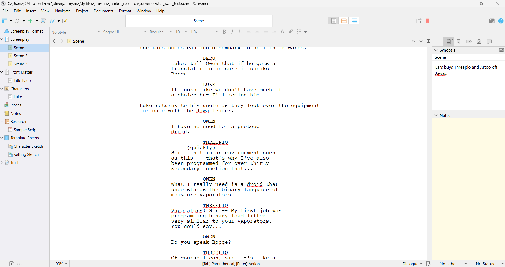

The Footer Bar changes when entering the **Script Mode** from the format menu under *Scriptwriting*.
This bar now shows the current element that is being input or selected from the script with other
actions that can be taken in the middle of the bar (Enter pulls up a choice of element). Scrivener
has the following elements in their script mode:
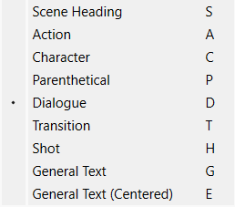

The scenes can be seen put together in the Scrivenings Mode:
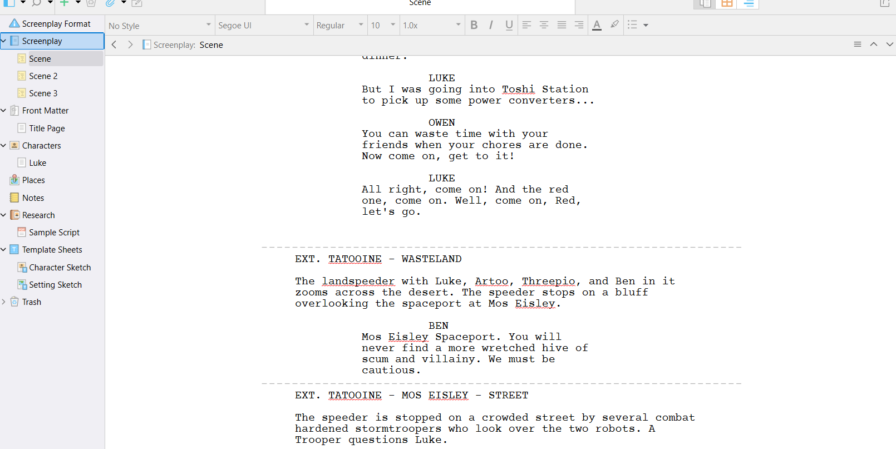

This was also done to test the compile feature and the output pdf can be found:
`./star_wars_test_pdf.pdf`

Scrivener also does have a night mode as can be seen below:
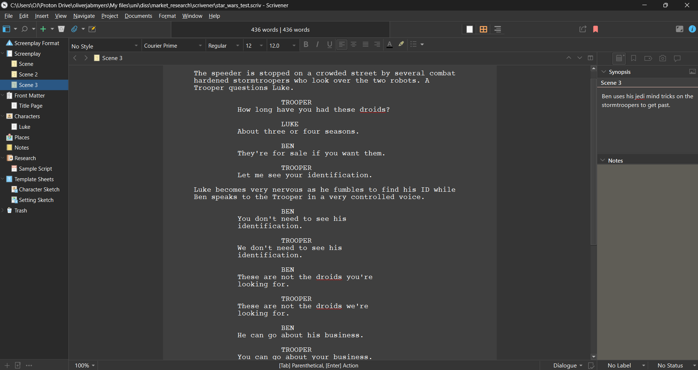

It was determined from the project files that Scrivener saves the script as an `.rtf` file and
styles the text to look like it is in script format. This is then formatted into the proper format
at compile. It should be noted that this is important as it does not treat the script as a database.
Other editors such as final draft can have smart features using this data.

## List of Features
**Writing Engine**
- Scriptwriting Mode: This is a view layer over an rtf file.
- Element Recognition
- Typewriter Mode

**Story Architecture & Planning**
- The Binder
- Corkboard Mode
- Outliner Mode
- Split Screen

**Production & Workflow**
- Snapshots
- Project Targets
- Metadata and Labels
- Compile

**Collaboration & Data Management**
- Snapshot managment
- Backups

**Accessibility & Value**
- Price: £50
- Separate licenses for different platforms.
- Tutorial (lengthy)

## External References
[Industrial Scripts](https://industrialscripts.com/final-draft/#h-scrivener) mentions that
"Scrivener is software for authors of all types". This article specifically features the corkboard
feature as well as its ability to "export documents as PDFs or in Final Draft or Fountain for 
further editing".

[Dave Chesson](https://kindlepreneur.com/scrivener-review/) in this review makes some good points
on the Scrivener Software:
- " Scrivener, as you will see, is so jam packed with so many features for so many different types 
  of writing needs, that it can be seriously hard to learn how to use." Scrivener markets itself to
  screenwriters, authors, researchers, and other types of creative writers who all require
  differing features. Therefore it can be hard to find little features you might need among so many
  others.
- Dave outlines the best features such as the **binder** and its effect on organisation of a big
  project, **composition mode** for its "distraction free writing environment". And also negatives
  such as the **separate licensing**, lack of **collaboration** and the steep **learning curve**.

[Relja Novović](https://io.bikegremlin.com/31401/scrivener-rant-not-review/) provides thoughts from
a authors perspective on the software which may extend from the screenwriters perspective. In this
review the following notable points were made:
- Steep **Learning Curve**: "Be prepared to invest a lot of time and effort in order to use this 
  software effectively".
- **Formatting Problems** for self publishing. While not specifically screenplay related, the
  problem could extend.

[Charles Harris](https://charles-harris.co.uk/2018/02/scrivener-review-road-test/) reviews Scrivener
and points out the following:
- "The convenience of Scrivener for a writer can be seen immediately. All is on view at the same 
  time". This could demonstrate the need to not have features hidden in menus.
- "one of the most useful features turned out to be the notepad". The **notepad** feature provides
  an easy way of making notes on a document and removes a choice about organisation of notes because
  they are linked to the documents/folders.
- "Compile is a very powerful feature...But, unless you are technically competent, it can be rather 
  scary to use". This may also be referencing the problem of the steep **learning curve** and
  technical knowledge one must have to make things work.

[Christopher Shulz](https://litreactor.com/columns/product-review-scrivener) provides a detailed
review for this software.
- "I remembered that my reasons for avoiding any kind of total immersion into Scrivener were: one, 
  there's a slight learning curve to it". Once again this **learning curve** is mentioned.
- Christopher also makes a note of the **character** and **location sheets** that help keep the
  creative process going. (These do not auto update because of the `.rtf` format)

## Conclusions
From a technical standpoint I dislike the use of the `.rtf` format with a layer over it to display
it as a script. I think that the open screenplay format which is based on `xml` would be much
better as it allows features around having the script as a database. I believe that `xml` files
would be easier to use from a software standpoint as well.

A lot of the external references brought up the steep **learning curve**. I found this to be true as
testing this software took longer than the other ones researched. This may be down to the fact that
Scrivener aims to provide its platform to a wide variety of writers as seen in their website here:
[Scrivener](https://www.literatureandlatte.com/scrivener/overview?fpr=arye66): "Scrivener is the 
go-to app for writers of all kinds, used every day by best-selling novelists, screenwriters, 
non-fiction writers, students, academics, lawyers, journalists, translators and more". However there
were a lot of features in the tutorial that would be for writers other than scriptwriters.

The features that made this software impressive were:
- The **Binder**
- **Compile**
- **Corkboard**
- The **Outliner**
- The inspector (specifically the label, status, comments, notes and synopsis features)

Notably from a screenwriters perspective there is not a beat board feature. This differs from the
corkboard as the corkboard is hierarchical and a beat board would be infinite and independent from
the script. Scrivener also lacks production features such as scene numbering locking, revision mode
logic for scripts, and production reports. This includes Cast breakdowns, Location Reports, 
Dialogue Tallies.

It should also be noted that while the trial period for this applicaiton is a generous 30 days and
does not pull any features, the price is £55 which may turn people away from using it. (This is not
a lifetime purchase as new versions require further purchase)