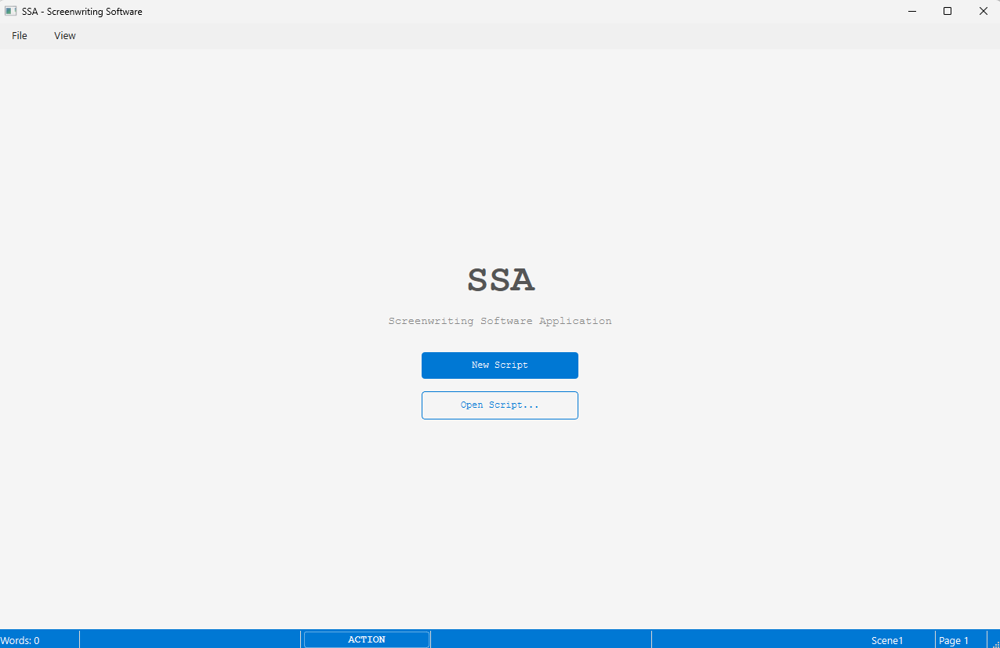
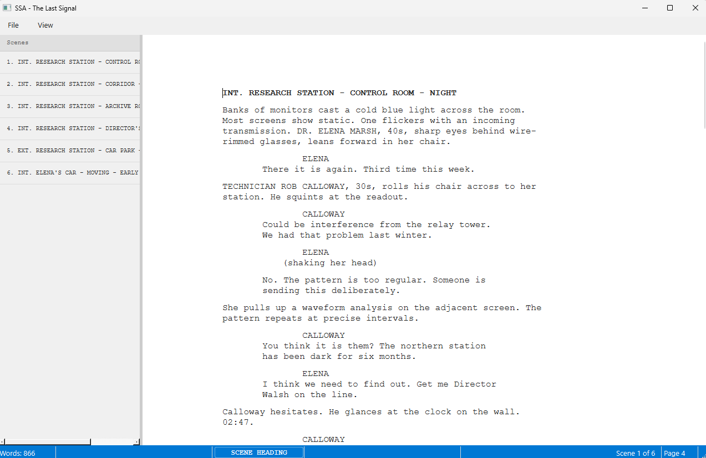

# Screenwriting-Project-Dissertation

SSA is a free, open-source desktop screenwriting application built in C++ using the Qt 6 framework.
It enforces industry standard screenplay formatting, organises scripts into navigable scenes, and
exports submission ready PDFs.




## Features
- Industry standard screenplay formatting (Courier New 12pt, correct margins).
- Seven element types: Scene Heading, Action, Character, Dialogue, Parenthetical, Transition, Shot.
- Tab and Enter key element type cycling.
- Scene navigator panel with real-time updates.
- Save and load using the Open Screenplay Format (.osf).
- PDF export with title page.
- Dark and light theme with system theme detection.
- Welcome screen

## Download

A pre-built Windows binary is available from the [Releases](../../releases) page. Download the zip,
extract it, and run `ssa.exe` (No installation required).

## Building From Source

### Requirements

- Qt 6.6 or later with the following modules:
  - Qt Widgets
  - Qt Xml
  - Qt PrintSupport
- CMake 3.16 or later
- A C++17 compatible compiler (MSVC, MinGW, or Clang)
- Qt Creator (recommended) or any CMake-compatible IDE

### Steps

1. Clone the repository `git clone https://github.com/45inertia/Screenwriting-Project-Dissertation.git`
2. Open Qt Creator and select `File -> Open File or Project`
3. Navigator to the `Final-Project/ssa/` folder and open `CMakeLists.txt`
4. Qt Creator will configure the project automatically. Select a Qt 6 kit when prompted.
5. Build the project **Ctrl+B**
6. Run with **Ctrl+R**

### Command Line Build

```bash
mkdir build && cd build
cmake .. -DCMAKE_BUILD_TYPE=Release
cmake --build .
```

## File Format
Scripts are saved in the Open Screenplay Format (.osf). This is an open XML based standard designed
for screenwriting data. Files are human readable and can be opened in any text editor.

## Architecture
The application follows the Model-View-ViewModel (MVVM) pattern. Full architecture documentation is
available in `Documentation/`

## License

MIT License - free to use, modify, and distribute 

## Author

Oliver Myers - COM629 Dissertation Project
Southampton Solent University, 2026